# 🔥 FlameLink Architecture Documentation

> **Decentralized One-Time Secrets with True Cryptographic Guarantees**

FlameLink combines **Walrus decentralized storage** with **client-side encryption** and a **one-time claim gate** to create truly unstoppable, trustless one-time secrets.

---

## 🎯 Simple Overview


**Key Innovation**: The AES decryption key is split in two. Half goes in the URL, half is stored server-side and can only be claimed once. Without both halves, the secret cannot be decrypted.

---

## 🏗️ Detailed Flow Diagram

```mermaid
sequenceDiagram
    participant User as 👤 Creator
    participant Browser as 🌐 Browser
    participant ClaimAPI as 🔐 Claim API
    participant Walrus as 🐋 Walrus Network
    participant Recipient as 👥 Recipient
    
    Note over User,Walrus: Secret Creation Flow
    User->>Browser: Enter secret text
    Browser->>Browser: Generate AES-256-GCM key
    Browser->>Browser: Encrypt secret with key
    Browser->>Browser: Split key: K = K1 ⊕ K2
    
    Browser->>Walrus: Store encrypted data
    Walrus-->>Browser: Return blobId
    
    Browser->>ClaimAPI: Initialize claim with K2
    ClaimAPI-->>Browser: Return claimId + token
    
    Browser->>Browser: Generate URL: /secret/blobId#K1.IV.claimId.token
    Browser->>User: Display shareable link
    
    Note over User,Recipient: Secret Access Flow
    User->>Recipient: Share link (via email/chat)
    Recipient->>Browser: Open link
    Browser->>Browser: Parse URL parameters
    Browser->>Recipient: Show "Click to Reveal"
    
    Recipient->>Browser: Click reveal button
    Browser->>ClaimAPI: POST /api/claim {claimId, token}
    
    alt First access
        ClaimAPI->>ClaimAPI: Verify token, mark as claimed
        ClaimAPI-->>Browser: Return K2 (once only)
        Browser->>Browser: Reconstruct key: K = K1 ⊕ K2
        Browser->>Walrus: Fetch encrypted data by blobId
        Walrus-->>Browser: Return ciphertext
        Browser->>Browser: Decrypt with reconstructed key
        Browser->>Recipient: Show secret
        Browser->>Walrus: Attempt burn (best effort)
    else Already claimed
        ClaimAPI-->>Browser: 409 Already claimed
        Browser->>Recipient: Show "Secret already burned"
    end
```



---

## 🐋 Walrus Integration Architecture


### Walrus Endpoints Used

- **Publisher**: `https://publisher.walrus-testnet.walrus.space/v1/blobs?deletable=true&epochs=1`
  - Stores encrypted secrets as immutable blobs
  - `deletable=true`: Allows automatic cleanup after epoch
  - `epochs=1`: Short-lived storage for testing

- **Aggregator**: `https://aggregator.walrus-testnet.walrus.space/v1/blobs/{blobId}`
  - Retrieves encrypted data by blob ID
  - Decentralized, censorship-resistant access

---

## 🔐 Security Architecture


### Security Properties

1. **Zero-Knowledge**: Server never sees plaintext secrets
2. **Key Separation**: Decryption impossible without both K1 (client) and K2 (server)
3. **One-Time Claim**: K2 can only be retrieved once, ever
4. **Client-Side Crypto**: All encryption/decryption in browser
5. **Immutable Storage**: Walrus blobs cannot be modified or deleted
6. **No Local Storage**: Nothing persisted in browser

---

## 🔄 Data Flow Architecture

```mermaid
flowchart TD
    subgraph "Creation Phase"
        A[User Input] --> B[AES-256-GCM Encrypt]
        B --> C[Split Key K = K1 ⊕ K2]
        C --> D[Store Ciphertext on Walrus]
        C --> E[Store K2 in Claim Gate]
        D --> F[Get BlobId]
        E --> G[Get ClaimId + Token]
        F --> H[Generate URL]
        G --> H
        H --> I[Share Link]
    end
    
    subgraph "Access Phase"
        I --> J[Recipient Opens Link]
        J --> K[Parse URL Parameters]
        K --> L[Click Reveal]
        L --> M[Claim K2 from Server]
        M --> N{First Access?}
        N -->|Yes| O[Return K2]
        N -->|No| P[Return Error]
        O --> Q[Reconstruct K = K1 ⊕ K2]
        Q --> R[Fetch Ciphertext from Walrus]
        R --> S[Decrypt with K]
        S --> T[Display Secret]
        P --> U[Show "Already Burned"]
    end
    
    style B fill:#99ff99
    style D fill:#66ccff
    style E fill:#ffcc66
    style M fill:#ffcc66
    style R fill:#66ccff
    style S fill:#99ff99
```

---

## 📊 Component Breakdown

### Frontend Components

```mermaid
graph TB
    subgraph "React Components"
        HOME[HomePage]
        INPUT[SecretInput]
        LINK[LinkGenerated]
        VIEW[SecretView]
        SECRET[SecretPage]
    end
    
    subgraph "Utility Modules"
        CRYPTO[crypto.ts]
        WALRUS[walrus.ts]
    end
    
    subgraph "API Routes"
        INIT[/api/claim/init]
        CLAIM[/api/claim]
    end
    
    HOME --> INPUT
    INPUT --> CRYPTO
    INPUT --> WALRUS
    INPUT --> INIT
    INPUT --> LINK
    
    SECRET --> CRYPTO
    SECRET --> WALRUS
    SECRET --> CLAIM
    SECRET --> VIEW
    
    style CRYPTO fill:#99ff99
    style WALRUS fill:#66ccff
    style INIT fill:#ffcc66
    style CLAIM fill:#ffcc66
```

### File Structure
```
src/
├── app/
│   ├── components/
│   │   ├── SecretInput.tsx      # Create secret form
│   │   ├── LinkGenerated.tsx    # Display shareable link
│   │   └── SecretView.tsx       # Show decrypted secret
│   ├── secret/[blobId]/
│   │   └── page.tsx             # Secret reveal page
│   ├── api/claim/
│   │   ├── init/route.ts        # Initialize claim gate
│   │   └── route.ts             # One-time claim endpoint
│   ├── lib/
│   │   ├── crypto.ts            # Encryption utilities
│   │   └── walrus.ts            # Walrus API integration
│   ├── layout.tsx               # App layout
│   └── page.tsx                 # Homepage
```

---

## 🛡️ Security Model

### Threat Model

| Attack Vector | Mitigation |
|---------------|------------|
| **Server Compromise** | Server never sees plaintext; only stores random K2 shares |
| **Network Interception** | HTTPS + key in URL fragment (never sent to server) |
| **Multiple Access** | Claim gate ensures K2 released only once |
| **Walrus Manipulation** | Immutable blobs; worst case is DOS, not data breach |
| **Browser Extension** | Client-side crypto; no persistent storage |
| **Social Engineering** | User education; clear one-time warnings |

### Cryptographic Guarantees


---

## 🚀 Deployment Architecture

### Development Setup
- **Frontend**: Next.js 15 with React 19
- **Storage**: Walrus Testnet
- **Claim Gate**: In-memory Map (dev only)
- **Crypto**: Web Crypto API (browser native)

### Production Considerations


**Recommended Production Changes:**
- Replace in-memory store with Redis/Upstash KV
- Use Walrus Mainnet endpoints
- Add rate limiting and DDoS protection
- Implement monitoring and alerting
- Add backup claim gate instances

---

## 🎯 Unique Value Propositions

### vs Traditional Secret Sharing Services

| Feature | FlameLink | Traditional Services |
|---------|-----------|---------------------|
| **Storage** | Decentralized Walrus | Centralized servers |
| **Encryption** | Client-side AES-256 | Server-side (trust required) |
| **One-Time Guarantee** | Cryptographic (K2 claim) | Database flag (can be bypassed) |
| **Censorship Resistance** | Unstoppable | Can be shut down |
| **Zero Knowledge** | Mathematically guaranteed | Trust-based |
| **Recovery** | Impossible after burn | Admin can recover |
| **Uptime** | Decentralized network | Single point of failure |

### Technical Innovations

1. **Key Splitting with XOR**: Simple, secure, and efficient
2. **Walrus Integration**: True decentralization without blockchain complexity  
3. **Claim Gate Pattern**: Minimal server trust for maximum security
4. **URL Fragment Security**: Keys never touch server logs
5. **Progressive Enhancement**: Works without JavaScript for basic functionality

---

## 🔮 Future Enhancements

### Roadmap


### Potential Upgrades

1. **Sui Smart Contract**: Replace claim gate with on-chain claimable objects
2. **IPFS Integration**: Hybrid storage for larger files
3. **Multi-Recipient**: Split secrets among multiple recipients
4. **Time-Lock**: Secrets that unlock at specific times
5. **Audit Trail**: Cryptographic proof of access attempts

---

## 📖 Usage Examples

### Basic Secret Sharing
```bash
# 1. User creates secret
curl -X POST localhost:3000 -d "password123"
# Returns: https://flamelink.app/secret/ABC123#K1.IV.claim456.token789

# 2. Recipient accesses (first time)
curl https://flamelink.app/secret/ABC123#K1.IV.claim456.token789
# Returns: Decrypted secret + burned confirmation

# 3. Anyone tries again
curl https://flamelink.app/secret/ABC123#K1.IV.claim456.token789
# Returns: "Secret already burned"
```

### API Integration
```javascript
// Create secret programmatically
const response = await fetch('/api/create', {
  method: 'POST',
  body: JSON.stringify({ secret: 'my-api-key' }),
  headers: { 'Content-Type': 'application/json' }
})
const { link } = await response.json()
console.log('One-time link:', link)
```

---

## 🏆 Conclusion

FlameLink represents a new paradigm in secure communication: **truly decentralized, cryptographically guaranteed one-time secrets**. By combining Walrus's immutable storage with client-side encryption and a minimal trust claim gate, we achieve security properties that were previously impossible.

**Key Achievements:**
- ✅ Zero-knowledge architecture
- ✅ Cryptographic one-time guarantee  
- ✅ Censorship resistance via Walrus
- ✅ No single point of failure
- ✅ Minimal server trust requirements

**Perfect for:**
- API key sharing
- Password distribution  
- Sensitive document links
- Emergency contact information
- Any data that must be accessed exactly once

---

*Built with ❤️ using Next.js, Walrus, and Web Crypto API*
